# Kiwi Lingo: Your Guide to New Zealand Words & Phrases!

**View the live project [here](https://kiwi-lingo.herokuapp.com/)**

For my third milestone project (data centric) with The Code Institute, I decided to build a glossary database called Kiwi Lingo. It is an app intended to be accessible across all devices and used as a reference guide of commonly used words and phrases spoken by New Zealanders. 


## [**Contents**](#contents)

- [**UX**](#ux)
  - [Strategy](#strategy)
    - Project Description
      - User Stories
      - First Time User Stories
      - Registered User Stories
      - Site Owner User Stories  
  - [Scope](#scope)
  - [Structure](#structure)
    - Existing Features
    - Features left to be implemented
  - [Skeleton](#skeleton)
    - Wireframes
  - [Surface](#surface)
    - Colour Scheme
    - Typography
    - Imagery  

- [**Database Schema**](#database-schema)

- [**Technologies Used**](#technologies-used)
  - Languages Used
  - Frameworks, Libraries and Resources Used
  - Dependencies

- [**Testing**](#testing)

- [**Deployment**](#deployment)
  - GitHub- Initial Steps
  - Requirements
  - Deploying to Heroku

- [**Credits**](#credits)
  - Code
  - Content
  - Media
  - Acknowledgements

---

## UX

### Strategy

#### Project Description

Kiwi Lingo was created as an online reference/source primarily used for by people who have a genuine interest in colloquial New Zealand English, the Maori language and visitors planning to go to or visitors already in New Zealand. New Zealand English is plentiful in content, and of course Maori- the indigenous language of New Zealand (that is used by English speakers in New Zealand on a daily basis) and many words and phrases could be uploaded to the site which could give way to eventually being published in book-form.

Each word or phrase in the dictionary will have a definition and an example of how the word or phrase is commonly spoken by locals. Users to the site can vote on the popularity of the word should they choose.

Kiwi Lingo would be typically used for:

- First time visitors to New Zealand
- Visitors currently in New Zealand struggling to understand the locals
- Visitors or locals looking to brush up on their slang or use as a reference guide to teach others
- New Zealanders that would like to add their own words or phrases to help visitors to NZ and even store their own collection of Maori words/phrases if they are seeking to learn
- People that have visited NZ that would like to keep a log of phrases/words/slang encountered on their visit and retain for future visits to NZ

The aim behind Kiwi Lingo is to form an online dictionary/phrase reference guide to various words and phrases spoken in New Zealand. 
Visitors to the site will be able to sign up for an account so they can easily add (CREATE) any words or phrases to the dictionary that might be missing. Upon registering, users will be able to edit (UPDATE) their additions and also be able to edit or remove (DELETE) what they have added themselves. They can also view/search (READ) for words or phrases in the search tool bar.

A favourable outcome behind creating this site would be:
- With additions by new and existing users, it would allow growth to the site
- Bring more awareness to the Maori language
- An opportunity for the site owner to encourage the user to book excursions/holidays highlighted in the links throughout the site


### User Stories

#### First Time User Stories
##### As a first time user:
-  I want to be able to fully understand what the site is about.
-  I want to be able to navigate easily throughout the site.
-  I want to be able to search for words and phrases commonly spoken in New Zealand.
-  I want to be able to set up my own account and add my own words or phrases to the site.
-  I want to be able to view popular sayings and phrases by viewing the most popular/least popular additions.


#### Registered User Stories
##### As a regular user:

- I want to be able to easily log in and out of the site.
- I want to be able to edit or delete my additions to the site.
- I want to be able to view additions by other users.
- I want to be able to edit or delete my profile.
- I want to be able to contact the site owners.


#### Site Owner User Stories

- To provide information on the site and who it is intended for.
- To allow the site to be accessible (viewing only) without creating an account.
- To be easily contacted should the user lose their log-in details.
- To allow users to only edit or delete their own additions.
- To be able to delete any inappopriate content added by a registered user.


---


### Scope

For any user to the site:

- To easily understand the purpose of the site is for and to be able to easily register or log in
- Site to be responsive across all devices 
- A clear navigation menu on all pages thus allowing users to easily navigate around the site
- A way for the user to contact the site administrator should they need
- Glossary to be accessible to non-registered users/first-time users

For registered users:

- CRUD functionality where users can:
  - Create a profile and word/phrase to the site
  - Read or view words and phrases added to the site
  - Update their own additions to the site
  - Delete their word/phrase and in addition their profile should they choose
- Log in and log out functionality
- Clear profile page and list of their own added words on display 
- Clear messages in response to the user's actions

For site admin:

- CRUD functionality for the "categories" section (accessible only by site admin)
- To be able to edit and/or delete words added by registered users

### Structure

I decided to have the site divided into separate pages rather than all content on one page. New users will have access to the index/landing page, Log In page, Register page and Glossary- they also have access to contact the site owner, redirecting the user to the Contact Us page from the Glossary page. A registered user's navbar changes to a more classic navbar style as to not overcrowd the navbar with coloured buttons. The navbar and footer remains the same across all pages ensuring consistency to the site.

#### Existing Features:

- Base Page: visible across all pages:

  - Navbar (Desktop) - a simple and easy to use navbar without too many options or buttons to disuade user activity I went with a simple yet fun approach with the design. The navbar then changes when the user is logged in or out, or is the site owner.
  - Navbar (Mobile) - the mobile navbar features a slide option that is triggered by the hamburger icon in the fixed navbar. This allows for easier navigation across the site for mobile users while enhancing UX. 
  - Flash messages - using the imported 'flash' feature from Flask, there are flash messages that appear on each page each time the user interacts with the site by logging in, registering, logging out, adding a Tip, editing a Tip, and deleting a Tip.
  - Footer - Social media icons as well as a contact us link (email also provided) using a mailto link generator that opens the users preferred email provider, and a few links to help the user get inspired in planning their holiday or find out more about New Zealand. The links go to an external link so that the user can still stay on the Kiwi Lingo website.

- Home Page
  - A carousel image-display featuring New Zealand's most beautiful, iconic landmarks to attract new users into the site
  - A welcome message appearing as the user enters the site (on first image) allowing the user to see what the site is about
  - A clear and simple navbar directing the user to the site's main pages
  - A small yet clear section on what the site is and who it is intended for, headed by the brand font for consistency purposes
  - Below the About section, a search bar is provided giving the user another way to use or access the site

- Log In Page
  - A clear and responsive log in form where the user enters their username and password is provided
  - Navbar and footer is the same providing consistency
  - Large and eye-catching "Log In" button
  - If the user prefers to create a profile or register, a link to the Register page is provided below the Log In button

- Register Page
  - Similar to the log in page, a large form provided which includes the following fields to be filled out: first name (added to create a welcoming and informal tone), username, password and confirm password
  - A link to the "Log In" page below the Register button provided in case the user already has already registered

- Glossary Page
  - All users have access to the Glossary page, displaying all current user inputted words and phrases in a collapsible accordion format 
  - A search bar allowing the user to look up a word or phrase
  - Once a word is selected, the definition/example details of the word is displayed in a pop-out style and displays:
    - The chosen word's *category*
    - *Definition*
    - *Example* of where the word can be used
    - Who the word was added by
    - A like or dislike feature or voting system so the user can see the popularity of the word used
  - If the user is not logged in, a link to log in or register pages provided below the glossary
  - If the user is logged in, this changes using an if statement to add a word instead of log in/register
  - A link to the contact page (Give us Feedback) is provided should the user wish to contact the site owner

- Profile Page
  - Large profile card displaying the user's username
  - Displays the words or phrases added by the user, including edit and delete buttons
  - Inviting the user to add another word or phrase
  - The user can also delete their profile should they wish, ensuring the user is aware their added words will still remain should they delete their profile

- Add Word Page
  - Accessible only to registered/logged in users
  - Large form allowing the user to fill out the following fields:
    - *Category* that best fits the word
    - *Word*
    - *Definition*
    - *Example* of where the word can be used
  - Cancel and Add Word buttons to click when completed  

- Contact Us Page
  - Displays an inviting message for the user to contact the site owner and the following fields to be filled in:
    - *Name*
    - *Email*
    - *Message* 
  - Submit button  

- Manage Categories Page
  - Accessed only by the site owner
  - Displays all categories in a card panel format added by site owner
  - Site owner can add, edit or delete categories

- Log Out Page
  - The user will be redirected to the log in page upon logging out.


#### Features Left to Implement

- A collection or library of all the words the user has "liked". This could be a nice feature to have so that the user can keep a log of their favourite words or phrases should the website expand.
- Maori in itself is popular and keen interest among New Zealanders to learn. This could be made into its own site but because there are plenty of words and phrases tourists can use that is in Maori, I felt it was a good idea to include it as a category in Kiwi Lingo.
- The site to become a service platform featuring advertisements from several tourism companies in New Zealand, where the site owners benefit securing business from certain vendors and adding further exposure to thte site.

### Skeleton

#### Wireframes

The wireframes for Kiwi Lingo were created using [Balsamiq](https://balsamiq.com/)

They have been slightly modified since their creation as further design elements were came upon during development of the project.

Mobile and Tablet View:
<p>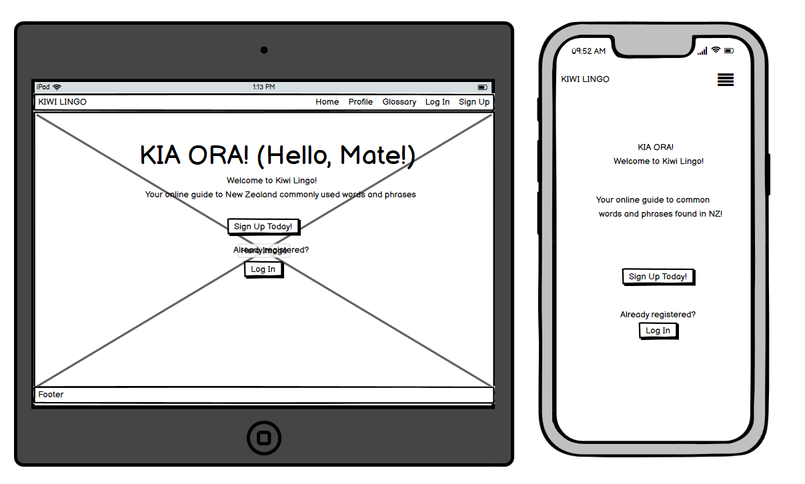
  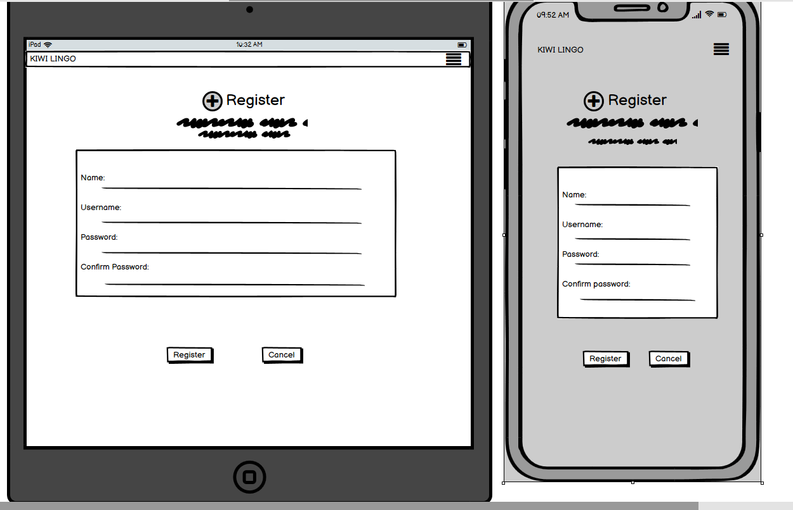
  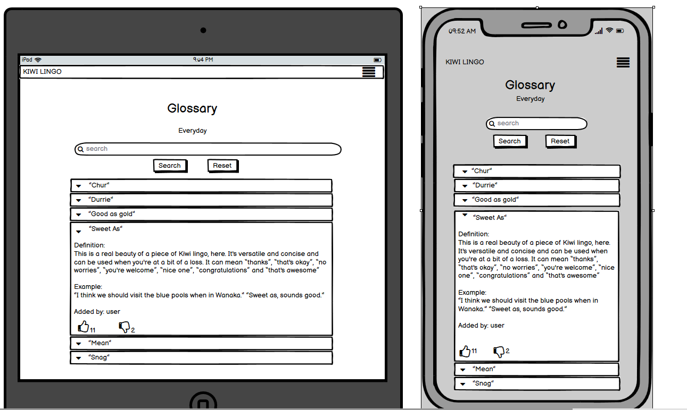
  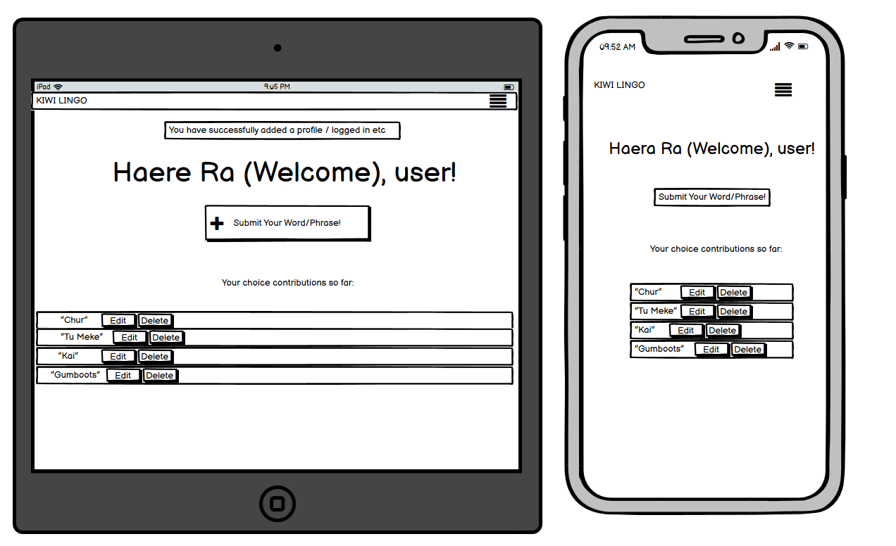
  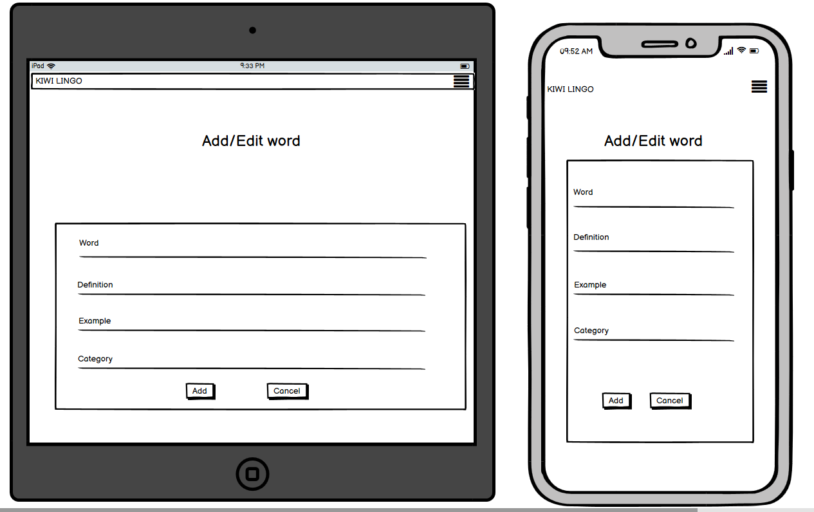
  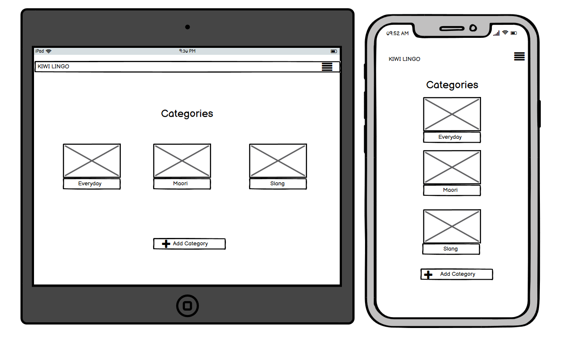
  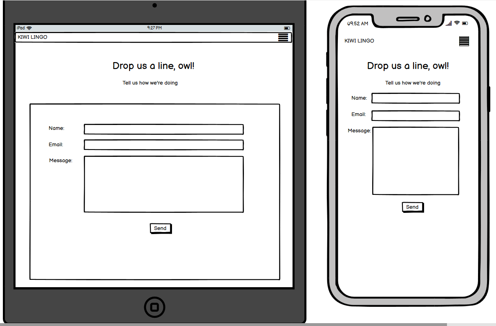</p>


Desktop View:

<p>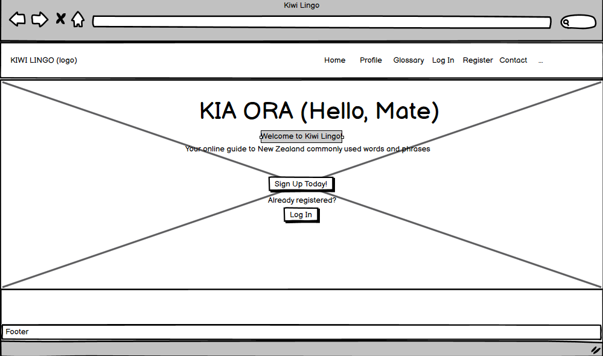
    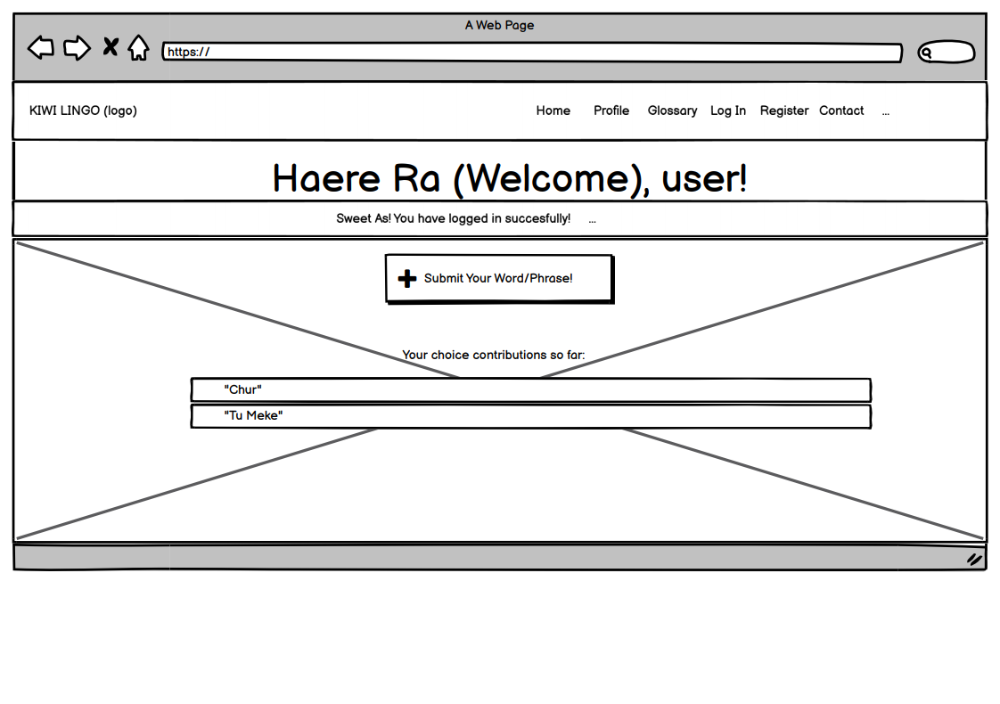
    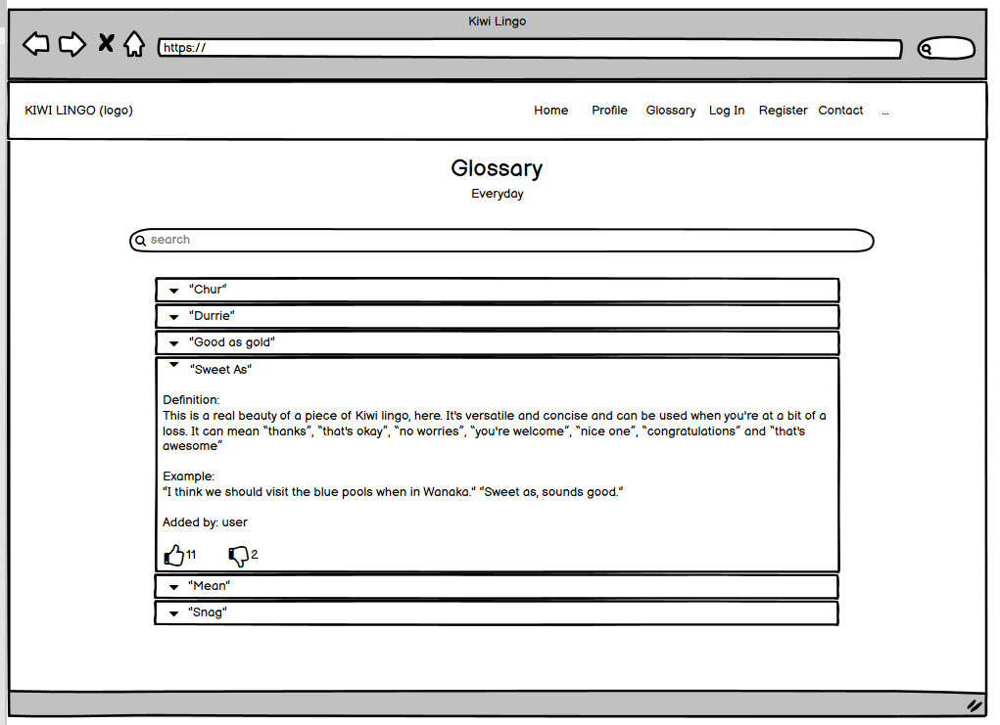
    
    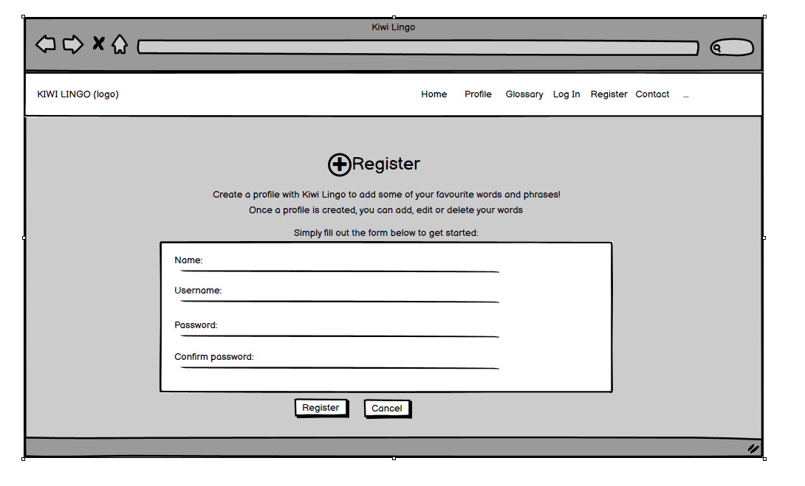
    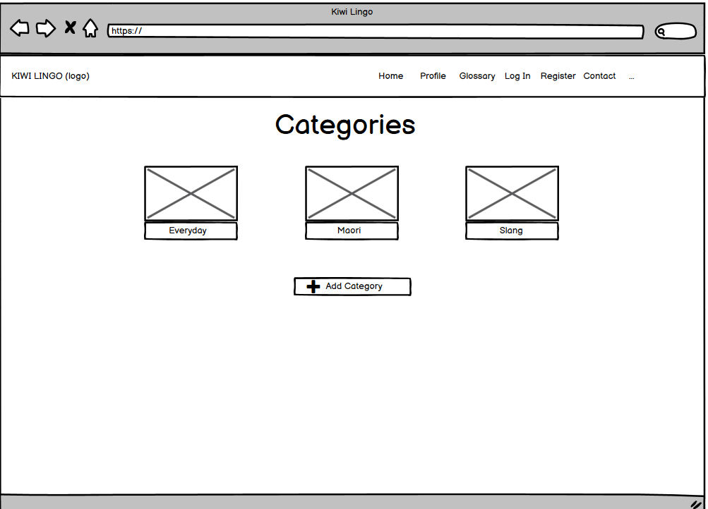
    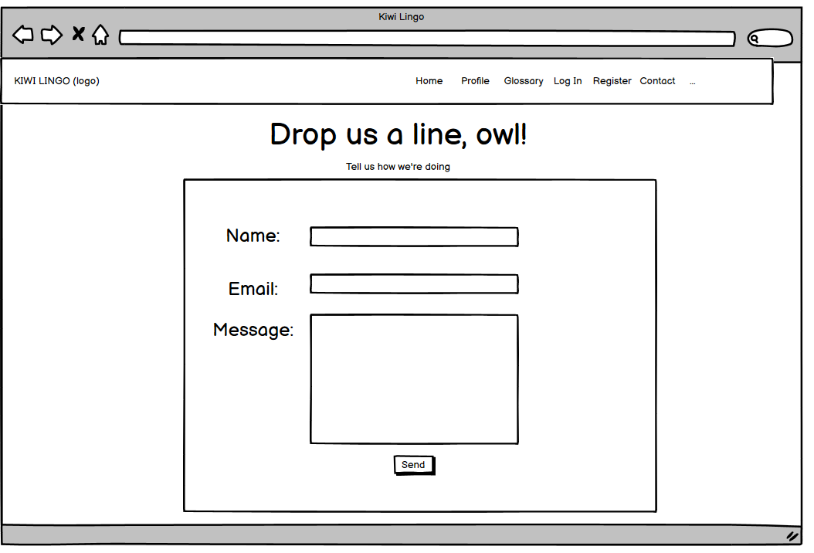
</p>

Full Wireframes can be found [here](https://github.com/elerel/ms3-kiwi-lingo/tree/master/readme/wireframes)

---

### Surface

#### Colour Scheme

The colour scheme in Kiwi Lingo is intended to be eye-catching and fun. I also wanted to incorporate some of the classic New Zealand colours, such as black, silver and white, adding in some eye-catching and attention-grabbing colours that are used mostly in the site's buttons and search bars. Throughout the site pages, I used a black to white linear gradient background image effect which seemed to work nicely with the theme of the site. I used [Color-Hex](https://www.color-hex.com/) to create the below colour chart. The main colours of the site used are:


#### Typography

Having taken inspiration from [100% Pure New Zealand](https://www.newzealand.com/ie/) I initially was looking to use the ["Pakati"](https://designersinstitute.nz/case-study/pure-pakati/) font, but I was unable to source it in any of the font libraries so instead went for something as close to it as possible, whilst keeping it a fun, informal theme, using ["Luckiest Guy"](https://fonts.google.com/specimen/Luckiest+Guy) which proved a good contender. I paired it with the font ["Raleway"](https://fonts.google.com/specimen/Raleway) and these are the two fonts mainly used throughout the site, using Sans Serif as the fallback font just in case there is any reason the chosen fonts are not being imported.


#### Imagery

New Zealand is without a doubt, captivatingly stunning in scenery. It was not at all difficult in choosing the imagery for this site and wanted to use the most eye-catching imagery possible, sourced from [Pexels](https://www.pexels.com/search/new%20zealand/) and [Pixabay](https://pixabay.com/images/search/new%20zealand/); the latter more so used. The images were then compressed using [TinyPNG](https://tinypng.com/) to make the loading time faster.

---

## Database Schema

[MongoDB Atlas](https://www.mongodb.com/) was the non-relational database used to create and store the collections for Kiwi Lingo.


A text version of the schema can be found [here](readme/data.txt)


## Technologies Used


### **Languages**
- [HTML]()
- [CSS]()
- [JavaScript]()
- [Python]() 
- Python Modules: ( as featured in this project's requirements.txt file);
    - click==7.1.2
    - dnspython==2.1.0
    - Flask==1.1.2
    - Flask-PyMongo==2.3.0
    - itsdangerous==1.1.0
    - pymongo==3.11.3
    - Werkzeug==1.0.1

## Frameworks, Libraries & Resources Used

1. [Autoprefixer CSS Online](https://autoprefixer.github.io/)
    -  used to parse project CSS and add vendor prefixes.
1. [Balsamic](https://balsamiq.com/)
    - Balsamiq is a UI wireframing tool used to create mockups of the site during the design process. 
2. [BSon](http://bsonspec.org/)
    - This was imported in order to access the data used across the site.
3. [ColorHex](https://www.color-hex.com/)
    - was used to create a color palette and color scheme for the site.
3.  [EmailJS](https://www.emailjs.com/) 
    - used to set up the email template for submission of contact form found on the Contact Page   
4. [Flask](https://flask.palletsprojects.com/en/1.1.x/)
    - The Flask framework was used to import the Flask, flash, render_template, redirect, request, session, and url_for functions that are used throughout the site.
5. [JQuery](https://jquery.com/)
    - I chose to use JQuery to initialise the components used in the Materialize framework. To add, I also used Code Institute's JQuery code from the Task Manager project so that the category names were correctly referenced.
6. [Font Awesome](https://fontawesome.com/)
    - Font Awesome was used throughout the website to add icons for aesthetic purposes and to enhance UX. 
7. [Git](https://git-scm.com/)
    - Git was used for version control by utilising the Gitpod terminal to commit to Git and push code to GitHub.
8. [GitHub](https://github.com/)
    - GitHub is used to store the code once being pushed from Git.
9. [Google Fonts](https://fonts.google.com/)
    - Google fonts were used to import the chosen fonts ('Luckiest Guy') which is used frequently with 'Raleway' font across the project.
10. [Heroku](https://dashboard.heroku.com/apps)
    - Heroku is used for deployment of the site.
10. [LucidChart](https://lucid.app)
    - A visual collaboration suite used to design the database schema diagram    
11. [Materialize 1.0.0](https://materializecss.com/)
    - Materialize was used to assist with the responsiveness and styling of the website, such as the navbars and footer for desktop and mobile, collapsible accordions (glossary page) and form elements used throughout the site.    
12. [MongoDB](https://www.mongodb.com/1)
    - MongoDB was used to host the data used on the site and was chosen due to the non-relational nature of the data.   
13. [Werkzeug](https://werkzeug.palletsprojects.com/en/1.0.x/)
    - This was imported in order for the password control to enhance security on the site.   
14.  [TingPNG](https://tinypng.com/)
      - This was used to resize the images.      


Back to [contents](#contents)   

---


## [Testing](#testing)

A full testing report can be found in a separate [TESTING.md](TESTING.md) file.


Back to [contents](#contents)

---

## Deployment

### Initial Steps

Kiwi Lingo was created using Gitpod and Git and Github to host the repository. Once an account is opened with Github, and logged in under your unique username, I selected "New" and then selected the [CI Gitpod Full Template](https://github.com/Code-Institute-Org/gitpod-full-template). From there, I chose the name **ms3-kiwi-lingo** as the repository name, selected it to be stored as a "public" repository and then selected "Create Repository".

From there, I navigated to my new repository on GitHub and clicked the green Gitpod button which built the Kiwi Lingo workspace. To access the workspace daily, I simply navigated to [Gitpod](https://gitpod.io/workspaces) where I could select its own unique workspace name and if not present, select "filter: all" :

 

 For version control, I used the following commands mainly throughout the project:

- git add filename/ git add -A/ git add . - These commands were used to add files to the staging area before committing.

- git commit -m "subject: commit message explaining the updates" - With reference to [Conventional Commits](https://www.conventionalcommits.org/en/v1.0.0/), providing an easy set of rules for creating an explicit commit history,  this command was used to to commit changes to the local repository.

- git push - This command is used to push all committed changes to the GitHub repository.

---
### Requirements

 In order to deploy, the following were installed:
- [PIP](https://pypi.org/project/pip/)
- [Python 3](https://www.python.org/)
- [Git](https://git-scm.com/)
- [Heroku CLI](https://devcenter.heroku.com/articles/heroku-cli)

1. To install all the requirements: Go to the workspace of your local copy. In the terminal window of your IDE type:
 ```bash
 pip3 install -r requirements.txt.
 ```
2. Create the project database with MongoDB:
    1. Signup Or Login For [MongoDB](https://www.mongodb.com/)
    2. Create a cluster as well as a database
    3. Create the following collections in the Database:
        1. categories
        2. users
        3. words

3. Create environment variables (env.py):
    1. Create a .gitignore file in the root directory of the project (which the CI Template already provides, otherwise type "touch .gitignore" )
    2. Create a file in the root directory called "env.py". This will contain all of your environment variables. Your env.py file should look similar to the following:

```
import os

os.environ.setdefault("IP", "0.0.0.0")
os.environ.setdefault("PORT", "5000")
os.environ.setdefault("SECRET_KEY", "YOUR_SECRET_KEY")
os.environ.setdefault("MONGO_URI", "YOUR_MONGODB_URI")
os.environ.setdefault("MONGO_DBNAME", "YOUR_DATABASE_NAME")
```

 Note: It is important that the user updates the secret keys and passwords. These details are private and are not disclosed in this repository for security purposes. Before pushing the project to a public repository, add your env.py file to .gitignore.

  3. The application can now be run locally by typing the following command into the terminal:

```
python3 app.py
```

### Deploying To Heroku

To deploy the application on Heroku, first we need to create a requirements.txt file as well as a **Procfile**. These files will allow Heroku understand 
what dependencies are required to run the application, as well as tell Heroku which file to run so that it can launch the application.

Enter the following in the CLI: 

```
pip3 freeze --local > requirements.txt
```

#### Create a procfile:

Enter the following in the CLI:

```
echo web: python app.py > Procfile
```

**Once created, you can see a list of all the dependencies listed in order to run the application:**


#### Creating a New App - Heroku

With the code required to run the app all stored in a repository with Github, deploying the app with Heroku can be done following these steps:

- Register/sign in to [Heroku](https://www.heroku.com/)

- Once signed in, click on the 'Create New App' button. 

- Choose a unique name (all lower case, no spaces) for your app, select your local region and click 'Create app'.

- In the top menu, select the 'Deploy' tab, and then click 'Connect to GitHub' in the 'Deployment method' section.

- Set up automatic deployment to your GitHub account to your Heroku account by clicking on the middle 'Connect to GitHub' button.


- Search for the GitHub repository which contains the name of your repo, and then click 'connect'. Before clicking Enable Automatic Deploys button, ensure the following is completed:

- Top of the page, click on the 'Settings' tab and then click 'Reveal Config Vars'.


- Within the 'Reveal Config Vars' section, add the variables (no quotation marks) which would be found in your local 'env.py' file. These variables are saved here as they contain sensitive data such as the password to the MongoDB database and the secret key required to use some of Flask's functionality.

- Back in the repository, make sure the two new additional files (Procfile and requirements.txt) are added to the staging area then to Github.

- With all of the previous steps complete, we can now click the "Enable Automatic Deploys" and "Deploy Branch". After a few minutes of loading the required packages, the app will now run by clicking the 'view' or 'Open app' buttons.


### Forking This Project:
  If you wish to contribute to this website you can Fork it without affecting the main branch by following the procedure outlined below.
  1. Go to GitHub's website and log in.
  2. Locate the Kiwi Lingo's [Repository](https://github.com/elerel/ms3-kiwi-lingo) in the search field.
  3. On the right-hand side of the Repository name, you'll see the 'Fork' button. It's located on the top right hand corner of the page, next to the 'Star' and 'Watch' buttons.
  4. This will create a copy in your personal repository.
  5. Once you're finished making changes you can locate the 'New Pull Request' button just above the file listing in the original repository.

### Cloning This Project:
To create a clone, follow the following steps.

1. Log in to GitHub and go to the repository.
2. Click on the button with the text “Code”.
3. Click “Open with GitHub Desktop” and follow the prompts in the GitHub Desktop Application or follow the instructions from [GitHub](https://docs.github.com/en/free-pro-team@latest/github/creating-cloning-and-archiving-repositories/cloning-a-repository#cloning-a-repository-to-github-desktop) to see how to clone the repository in other ways.

Back to [contents](#contents)
---

## Credits

### Code Snippets

- Thumbs Up/Thumbs Down Feature: having done some research using W3 Resource as mentioned below, I also studied fellow student, [Karen Yuen's Likes and Dislikes function](https://github.com/karzuin/jokes_library_MS3/blob/master/templates/jokes.html) in her MS3 project, Laugh Out Loud. 

- EmailJS- Contact Us Page:
  - The Code Institute's EmailJS module was used as a resource for setting up the contact page and ensuring emails were sent/received successfully.

- Delete Confirmation Modals:
  - Thanks to Ed_B and other fellow students through the support channel, received help in setting up the delete confirmation modals ("to make sure that each delete button has a unique url / data-target pointing to the corresponding unique modal id. This can be done using either the item's _id or via {{ loop.index }}")thus adapted and used mainly in the Glossary Page and Profile Page of the project.

- Error Handling:
  - Thanks to Ed_B_lead and Eventyret_mentor through Slack for this one on error handling; for assistance and code snippets used the 404.html and 500.html pages. The code snippet is taken from #data-centric-dev Slack Channel.

- The Task Manager Mini Project proved to be the main source were code snippets were taken from and modified- it was the primary source for setting up Kiwi Lingo.


### Content

- [Regional Slang Article](https://www.stuff.co.nz/national/99763866/hey-uce-heres-a-meanas-guide-to-kiwi-regional-slang)- referenced for regional slang.
- [Kiwi Slang 101](https://www.kaitiaki.co.nz/2018/02/16/kiwi-slang-1-0-1/)- referenced for some Kiwi Slang.
- [W3 Resource](https://www.w3resource.com/mongodb/mongodb-field-update-operator-$inc.php) for help with likes and dislikes function
- [Stackoverflow](https://stackoverflow.com/questions/18574699/how-to-make-a-space-between-i-tags-icons-in-table/18574766) on rotating icons
- [Stackoverflow](https://stackoverflow.com/questions/36581504/materialize-carousel-slider-autoplay) for use of timer in carousel function
- [Flask Mega Tutorial, Pt VII](https://blog.miguelgrinberg.com/post/the-flask-mega-tutorial-part-vii-error-handling)- in reference to use of error functions


### Media

The imagery used in this site was obtained from:

- [Pexels](https://www.pexels.com/)
- [Pixabay](https://pixabay.com/images/search/new%20zealand/)


### Acknowledgements

- Special thanks and appreciation to my mentor, **Nishant Kumar** for all his guidance, amazing tips and his time throughout this project
- To the Code Institute Slack Support Channels and Student and Tutor Support: thank you especially Ed_B_lead, Eventyret_mentor, Istvan, Karen Yuen, Cormac and Tim for your help, greatly appreciated- you were always so quick to help in times of need.
- To my family for helping me check for bugs and compatibility issues on their devices- and to my husband and two girls for letting me sneak away to my desk all those times!
